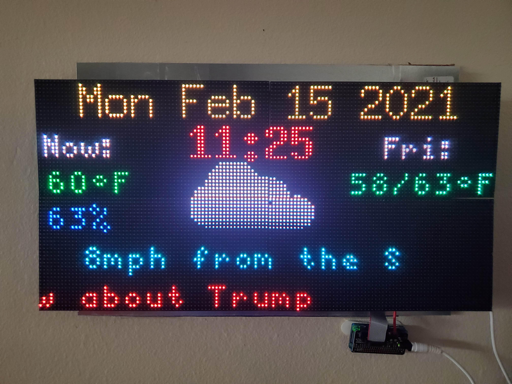

myWeatherPanel
============

My wife is always wondering about the weather, if it going to be too hot today, too hunid, and what about the rest of the week. So I decided to create a LED panel display for her that would answer all her questions and give me an excuse to learn about LED Panels.

Ok, full disclosure, the lock down was driving me nutz and I really didn't care all that much about the weather, I just needed something to do.

This work is based largely on the work of others and I try to give credit where I can

OverView
--------

This project was written in python3 on a Raspberry Pi 3B+, however almost any RPi can be used that supports WiFi. I actually run the project on a Raspberry Pi Zero WH. The project evolved as I learned more and more about using LED Panels and writing large python projects, so I am sure there are multiple places where the code can be made better, feel free to give me feedback. Here is an example of what the completed project looks like.

The left hand side shows today's temperature and humidity, the right hand side cycles through the week showing the high/low temperatures and the weather icon for each day. Below that is the wind speed and direction, and below that is a scrolling text that shows today's weather alerts, if there are any, for roughly 30 minutes then it will show to entries from the RSS feed(s) specified in the cfg file (see below).
The application will keep alternating between weather alerts and RSS feed entries. The variable *timeOut* in the code can be tweaked to change the display period. If more that one RSS feed is specified the application will rotate through them at every time out.

## Hardware

All of these items can be ordered from Amazon, AdaFruit, or DigiKey among others

- 4 pcs. 64x32 Led Panels with magnetic feet, I used a 4mm pitch (that is the distance between LEDs)
- 2 pcs. Power supplies for the Led Panels, I used ALITOVE 5V 15Amp Power Supplies because they are specifically designed for LED Panels
- 1 pc. Raspberry Pi that supports WiFi, I developed this on a RPi 3B+ for speed, but I run the actual project on a Rpi Zero WH
- 1 pc. AdaFruit RGB Matrix Bonnet for Raspberry Pi
- 1 pc. M3 Male-Female Brass Spacer Standoff & Stainless Steel Screw Nut Assortment Kit (optional)
- 8 pcs. MINI-MAGNET Feet for RGB LED Matric (optional)
- 5 pcs. 16 Pins Connector Flat Ribbon Cable Female Connector Length 30cm 2.54mm Pitch (optional)
- 2 pcs. 6"x18" steel sheets (optional)
- 1 pc. SDCard with the latest RaspiOS on it 

I do not have any wood/metalworking abilities or facilities, so the optional items were used to mount the LED panels without any kind of a custom frame. 

## Software

Create a directory on your RPi and clone this repository into it

	
#### Misc
- An account and an AppId from [open weather map](openweathermap.org)
	-  the account is free and is required to obtain the weather information
- [the latest Raspberry Pi OS image](www.raspberrypi.org/software/operating-systems)
	- downloading and installation directions are on the website
#### LED
- [hzellers rpi-rgb-led-matrix](github.com/hzeller/rpi-rgb-led-matrix) 
	- installation and usage directions are on the GitHub page. This is an excellant and powerful library for LED Panels.

## Installation
Before installing any new package or software, you should make sure your RPi is up to date by running the following commands:

	sudo apt-get update
    sudo apt-get -y full-upgrade
   
#### Git the weatherPanel Application

	git clone <code uri from github>
    
this should result in output something like this
	
    Cloning into 'myWeatherPanel'...
	remote: Enumerating objects: 111, done.
	remote: Counting objects: 100% (111/111), done.
	remote: Compressing objects: 100% (73/73), done.
	remote: Total 111 (delta 48), reused 93 (delta 34), pack-reused 0
	Receiving objects: 100% (111/111), 2.07 MiB | 3.36 MiB/s, done.
	Resolving deltas: 100% (48/48), done.
and create the directory myWeatherPanel

#### Git and Install the hzeller Library
I strongly recommend going to the hzellers github web page and reading through the documentation, it is full of useful information on how to configure and use LED panels in general and with the hzellers library.

	cd ~/ # or where ever you want to place the library
    git clone git@github.com:hzeller/rpi-rgb-led-matrix.gi
    cd rpi-rgb-led-matrix/
	sudo make
    cd bindings/paython
   
Then follow the directions is the *README.md* file to install the bindings for python3

#### Configuration

###### Open Weather Map
if you do not already have an account with Open Weather Map go to 

[Open Weather Map](openweathermap.org)

and create an account, the free one is sufficient, once you have created your account, login and click on your user name in the menu bar. Select **My API keys** and make a note of your key.

###### Configuration File

Using your favorite editor, edit the *sample_weatherPanel.cfg* file in the *weatherPanel* directory, the fields are:
- **[WEATHER]** section contains the values needed to obtain the weather information for your location
	- the **lat** and **lon** are the latitude and longitude from which you want the weather
	- **appid** is the API key you obtained from openweathermap.org
	- **units** are imperial or metric
- **[LED]** section contains the flags specified for the hzellers library software, these shouldn't need to be changed, if you need additional flags you can either pass them to the application in the command line or modify the code.
- **[RSS]** section contains the RSS feeds to be displayed
	- **RSS** the url of the feed(s) to be shown in the bottom scroll region, if there are more than one RSS feed, then the additional urls must each be on a seperate line and indented as shown in the *sample_weatherPanel.cfg* file
- **[MISC]** section contains additional settings
	- **weatherTimeOut** the number of passes through the main loop to make before switching to displaying the RRS feed(s)
	- **rssTimeOut** the number of passes through the main loop to make before switching to displaying the weather alerts, if there are any

Save the edited file as *weatherPanel.cfg*

###### Additional Libraries

- feedparser - parses the RSS feed
	- sudo pip3 install feedparser

## And We're Off

That should do it, to run it:

    chmod +x weatherPanel.py #once only
    sudo ./weatherPanel.py

## Extras
If you wish to run and stop the application from crontab, there are two shell scripts, *run.sh* and *stop.sh* that can be used to to do that 

#### Assembly
I don't have the skills or facilities to make a frame to this, so I improvised. I took the two metal sheets and taped them with packing tape to piece of cardboard. I then attached the magnetic feet to the backs of the LED panels (with the extenders to give the wiring more room) and stuck them to the metal sheets. Then using the mounting tabs of your choice you can mount the whole thing on the wall. 
    